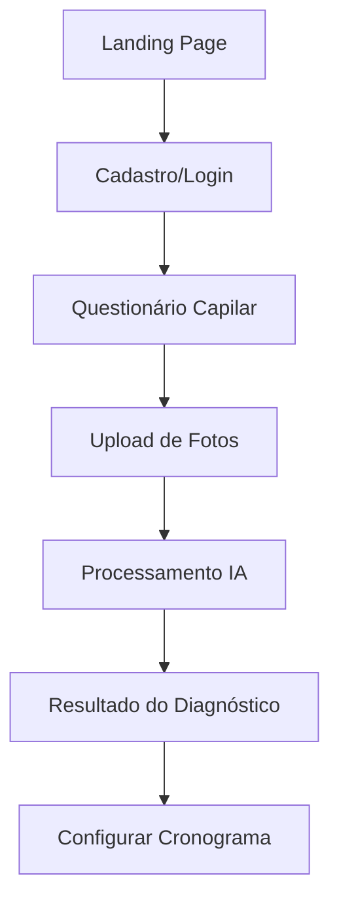

# PRD: CronoCapilar (CHS)

## Metadados
- **Baseado em:** 01-product-brief.md
- **Data:** 2026-02-06
- **Versão:** 1.2
- **Status:** Aprovado para execução

---

## 1. Requisitos Funcionais

### Legenda de Prioridade
- **P0 (Crítico):** Essencial para funcionamento básico e conformidade legal.
- **P1 (Importante):** Fundamental para proposta de valor e retenção.
- **P2 (Desejável):** Melhoria de UX ou funcionalidades estéticas.

---

### RF01: Diagnóstico Capilar Inteligente
| Campo | Valor |
|-------|-------|
| **ID** | RF01 |
| **Título** | Diagnóstico com Análise de IA |
| **Descrição** | Como cliente, quero responder um questionário e enviar fotos do meu cabelo para que a IA identifique o estado atual (hidratação/nutrição/reconstrução). |
| **Prioridade** | P0 |
| **Épico relacionado** | Epic 3 |

**Critérios de Aceite (Gherkin):**
```gherkin
DADO que a usuária iniciou o diagnóstico
QUANDO ela envia as respostas do questionário e as fotos solicitadas
ENTÃO o sistema deve invocar o Gemini 3 Flash para analisar as imagens
E retornar uma classificação do estado capilar predominante.
```

---

### RF02: Geração de Cronograma Customizável
| Campo | Valor |
|-------|-------|
| **ID** | RF02 |
| **Título** | Plano de Tratamento Personalizado |
| **Descrição** | Como cliente, quero visualizar um cronograma gerado baseado no diagnóstico e poder escolher os dias e horários das aplicações. |
| **Prioridade** | P0 |
| **Épico relacionado** | Epic 4 |

**Critérios de Aceite (Gherkin):**
```gherkin
DADO que o diagnóstico foi concluído
QUANDO o sistema gera a sugestão de cronograma
ENTÃO a usuária deve poder editar os dias da semana e horários de preferência
E o sistema deve salvar essas preferências no perfil da usuária.
```

---

### RF03: Exportação para Calendário (Google & iOS)
| Campo | Valor |
|-------|-------|
| **ID** | RF03 |
| **Título** | Sincronização com Agendas Digitais |
| **Descrição** | Como cliente, quero exportar meu cronograma para o Google Calendar ou Apple Calendar (iOS) para receber alarmes nativos no meu celular. |
| **Prioridade** | P1 |
| **Épico relacionado** | Epic 4 |

**Critérios de Aceite (Gherkin):**
```gherkin
DADO que o cronograma está definido
QUANDO a usuária escolhe sua plataforma de preferência (Google ou iOS/iCloud)
ENTÃO o sistema deve realizar a integração via API (Google) ou gerar um link de assinatura de calendário/arquivo .ics (iOS/Apple)
E garantir que os alarmes de notificação estejam configurados nos eventos criados.
```

---

### RF04: Alertas de Recompra Inteligente (SMS)
| Campo | Valor |
|-------|-------|
| **ID** | RF04 |
| **Título** | Notificação de Esgotamento de Produto |
| **Descrição** | Como cliente, quero receber um SMS quando o sistema prever que minha máscara está acabando, com um link para recompra. |
| **Prioridade** | P1 |
| **Épico relacionado** | Epic 5 |

**Critérios de Aceite (Gherkin):**
```gherkin
DADO que o sistema calculou que restam 5 dias para o fim do produto
QUANDO chega na data prevista
ENTÃO o sistema deve enviar um SMS via Twilio com link encurtado (Bit.ly) para a loja.
```

---

### RF05: Gestão de Privacidade (RGPD)
| Campo | Valor |
|-------|-------|
| **ID** | RF05 |
| **Título** | Controle de Dados e Opt-in |
| **Descrição** | Como usuária francesa, quero dar consentimento explícito e ter a opção de apagar meus dados, conforme o RGPD. |
| **Prioridade** | P0 |
| **Épico relacionado** | Epic 2 |

**Critérios de Aceite (Gherkin):**
```gherkin
DADO que a usuária está se cadastrando ou acessando o sistema
QUANDO ela gerencia suas configurações de conta
ENTÃO o sistema deve permitir o download de seus dados ou a exclusão total da conta
E garantir opt-in duplo para comunicações de marketing.
```

---

### RF06: Autenticação e Gestão de Perfil
| Campo | Valor |
|-------|-------|
| **ID** | RF06 |
| **Título** | Login Social/E-mail e Perfil da Usuária |
| **Descrição** | Como cliente, quero me autenticar via Google ou e-mail/senha e gerenciar meu perfil capilar (tipo de cabelo, preferências, telefone) para que o sistema personalize minha experiência. |
| **Prioridade** | P0 |
| **Épico relacionado** | Epic 2 |

**Critérios de Aceite (Gherkin):**
```gherkin
DADO que a usuária acessa a aplicação pela primeira vez
QUANDO ela se autentica via Google ou e-mail/senha
ENTÃO o sistema deve criar um registro na coleção `users` com `userId`, `email`, `authProvider` e `createdAt`
E redirecionar para a tela de completar perfil com campos `hairType`, `hairLength`, `phoneNumber` e `preferredLanguage`
E após salvar o perfil, marcar `profileComplete: true`.
```

---

### RF07: Geração de Cronograma Capilar
| Campo | Valor |
|-------|-------|
| **ID** | RF07 |
| **Título** | Algoritmo de Ciclo H/N/R e Visualização Semanal |
| **Descrição** | Como cliente, quero que o sistema gere automaticamente um cronograma de 4 semanas baseado no meu diagnóstico e quero visualizar os próximos 7 dias de tratamentos. |
| **Prioridade** | P0 |
| **Épico relacionado** | Epic 4 |

**Critérios de Aceite (Gherkin):**
```gherkin
DADO que o diagnóstico capilar foi concluído com sucesso
QUANDO o sistema processa o resultado (hairType, porosity)
ENTÃO deve gerar um ciclo de 4 semanas com sequência H/N/R adaptada ao tipo capilar
E a tela "Mon Calendrier" deve exibir os próximos 7 dias com tipo de tratamento e produto recomendado
E o dia atual deve estar visualmente destacado
E dias sem tratamento devem exibir "Jour de repos".
```

---

### RF08: Infraestrutura e Localização
| Campo | Valor |
|-------|-------|
| **ID** | RF08 |
| **Título** | Setup de Projeto com i18n, CI/CD e Região Europeia |
| **Descrição** | Como equipe técnica, quero o projeto configurado com React 19 + Vite, Firebase na região `europe-west1`, i18next para FR/EN e pipeline CI/CD para que o desenvolvimento seja produtivo e conforme ao RGPD desde o início. |
| **Prioridade** | P0 |
| **Épico relacionado** | Epic 1 |

**Critérios de Aceite (Gherkin):**
```gherkin
DADO que o projeto está sendo inicializado
QUANDO a infraestrutura é configurada
ENTÃO o Vite deve servir a aplicação React 19 com Tailwind CSS e tokens de design configurados
E o Firebase deve estar inicializado na região `europe-west1` com Firestore, Auth, Functions e Storage
E o i18next deve carregar traduções em FR (padrão) com fallback EN
E cada push na branch `main` deve disparar build + deploy automático via GitHub Actions + Firebase Hosting.
```

---

### RF09: Dashboard Administrativo
| Campo | Valor |
|-------|-------|
| **ID** | RF09 |
| **Título** | Dashboard de Conversão e Métricas para Gestores CHS |
| **Descrição** | Como administrador CHS, quero visualizar métricas de conversão (diagnósticos realizados, SMS enviados, cliques em links de recompra) para que eu possa acompanhar a performance comercial da plataforma. |
| **Prioridade** | P2 |
| **Épico relacionado** | Epic 6 |

**Critérios de Aceite (Gherkin):**
```gherkin
DADO que o administrador está autenticado no Dashboard Admin
QUANDO ele seleciona um período de análise (ex: últimos 30 dias)
ENTÃO o sistema deve exibir os KPIs consolidados: `totalDiagnostics`, `totalSMSSent`, `totalBitlyClicks`, `conversionRate`
E um gráfico de funil comparando diagnósticos feitos vs links clicados
E os dados devem ser atualizados diariamente via Cloud Scheduler (agregação às 02:00 UTC).
```

---

### RF10: Cálculo de Consumo e Recompra
| Campo | Valor |
|-------|-------|
| **ID** | RF10 |
| **Título** | Estimativa de Estoque Virtual e Encurtamento de Links |
| **Descrição** | Como sistema, quero calcular o consumo de produto da usuária (ml por sessão) e prever a data de esgotamento para que links de recompra encurtados (Bit.ly) sejam enviados por SMS no momento certo. |
| **Prioridade** | P1 |
| **Épico relacionado** | Epic 5 |

**Critérios de Aceite (Gherkin):**
```gherkin
DADO que a usuária possui um produto cadastrado com volume inicial (ex: 300ml) e consumo por sessão (ex: 30ml)
QUANDO o sistema calcula o estoque virtual com base no cronograma ativo
ENTÃO deve determinar a `estimatedDepletionDate` e atualizar `remainingMl` após cada sessão
E quando restarem 2 sessões ou menos, o produto deve ser marcado como `lowStock: true`
E o link de recompra deve ser encurtado via Bit.ly antes de ser incluído no SMS
E em caso de falha do Bit.ly, o link original deve ser usado como fallback.
```

---

## 2. Requisitos Não-Funcionais

### RNF01: Performance e Localização
| Aspecto | Requisito | Como medir |
|---------|-----------|------------|
| Tempo de Resposta | < 200ms (p95) para APIs core | Firebase Performance |
| Hosting Europa | Hosting em região UE (`europe-west1`) | Configuração de Infra |
| i18n | Interface 100% em francês (fr-FR) | Auditoria de Tradução |

### RNF02: Segurança e Conformidade
| Requisito | Implementação |
|-----------|---------------|
| Autenticação | Firebase Auth (Google + E-mail) |
| Criptografia | Dados em repouso no Firestore e em trânsito via TLS |
| RGPD Compliance | Retenção de dados de 24 meses; rotinas de auto-deleção |

### RNF03: Observabilidade e Operação
| Requisito | Implementação |
|-----------|---------------|
| Logging estruturado | `requestId`, `userId`, `action`, `statusCode` |
| Alertas operacionais | Erro > 1% em 15 min e falha SMS > 10% |
| Rastreabilidade de releases | Toda release vinculada a PR e changelog |

---

## 3. Fluxos de Usuário (User Journeys)

### Fluxo 1: Onboarding e Diagnóstico



---

## 4. Integrações

| ID | Serviço | Propósito | Fallback |
|---|---|---|---|
| INT01 | **Google Calendar API** | Exportar cronograma com alarmes | Arquivo .ics |
| INT02 | **Twilio (SMS)** | Notificações prioritárias (+33) | SendGrid (Email) |
| INT03 | **Gemini 3 Flash** | Análise de fotos capilares | Diagnóstico textual manual |
| INT04 | **Bit.ly** | Encurtamento de links para SMS | Link original |

---

## 4.1 Regras de Negócio e Edge Cases (Obrigatório)
| ID | Regra | Comportamento Esperado |
|----|-------|------------------------|
| BR-01 | Falha da IA no diagnóstico | Exibir erro amigável, permitir reenvio e fallback textual |
| BR-02 | Falha no Bit.ly | Enviar SMS com link original |
| BR-03 | Telefone inválido para SMS | Bloquear opt-in até formato E.164 válido |
| BR-04 | Ausência de consentimento RGPD | Bloquear fluxo que persiste dados sensíveis |
| BR-05 | Duplicidade de alerta de recompra | Idempotência por `userId + campaignDate` |
| BR-06 | Erro no Google Calendar | Disponibilizar exportação `.ics` |

---

## 5. GAP Analysis: Produto e Negócio

### 5.1 Capability Assessment
| Capacidade | Nível Necessário | Nível Atual | GAP | Esforço |
|------------|-----------------|-------------|-----|---------|
| IA Visual | Análise de textura/frizz | Greenfield | Integração Gemini | Médio |
| Automação SMS | Disparo baseado em estoque | Greenfield | Lógica de estoque virtual | Médio |
| Compliance EU | Conformidade total RGPD | Greenfield | Termos legais + Infra EU | Alto |

### 5.2 GAP Inventory
| ID | Área | AS-IS | TO-BE | GAP | Severidade | Prioridade |
|----|------|-------|-------|-----|------------|------------|
| G-PRD-01 | IA Visual | Greenfield | Diagnóstico automatizado | Integração Gemini em produção | Alta | P0 |
| G-PRD-02 | Retenção | Greenfield | Recompra orientada por consumo | Lógica robusta de estoque virtual | Alta | P0 |
| G-PRD-03 | Compliance | Greenfield | Operação legal na França | Política legal + processos RGPD | Alta | P0 |

---

## 6. Matriz de Rastreabilidade (Obrigatória)
| Feature (Brief) | Requisito PRD | Backlog Story |
|-----------------|---------------|---------------|
| Diagnóstico IA | RF01 | 3.1, 3.2, 3.3, 3.4 |
| Cronograma Customizável | RF02, RF07 | 4.1, 4.2 |
| Exportação Calendário | RF03 | 4.3 |
| Alertas de Recompra SMS | RF04, RF10 | 5.1, 5.2, 5.3 |
| Gestão de Privacidade RGPD | RF05 | 2.3 |
| Autenticação & Perfil | RF06 | 2.1, 2.2 |
| Infraestrutura & Localização | RF08 | 1.1, 1.2, 1.3, 1.4 |
| Dashboard Admin | RF09 | 6.1, 6.2 |

---

## 7. Glossário

| Termo | Definição |
|-------|-----------|
| **H/N/R** | Hidratação, Nutrição e Reconstrução (fases do cronograma). |
| **PDV** | Ponto de Venda (lojas físicas da CHS). |
| **Opt-in** | Ação positiva do usuário para permitir o uso de seus dados. |
