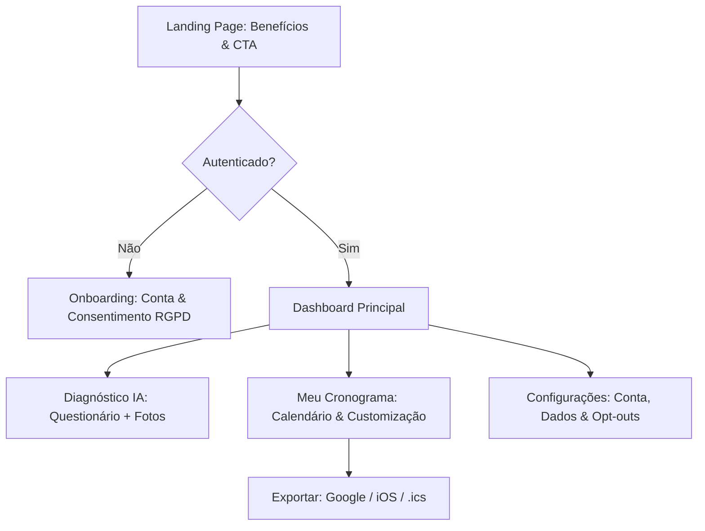
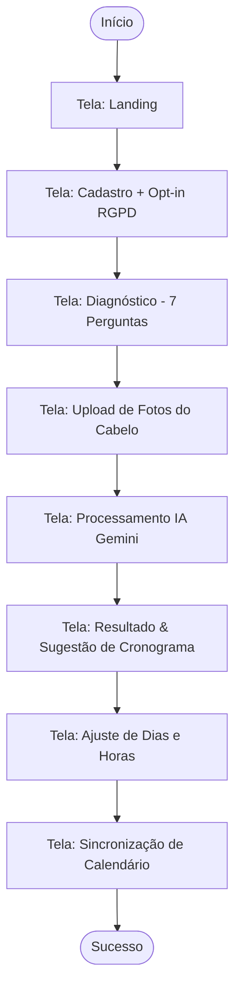
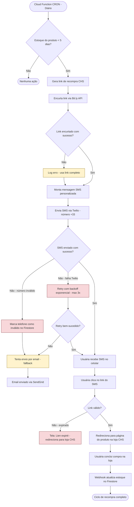
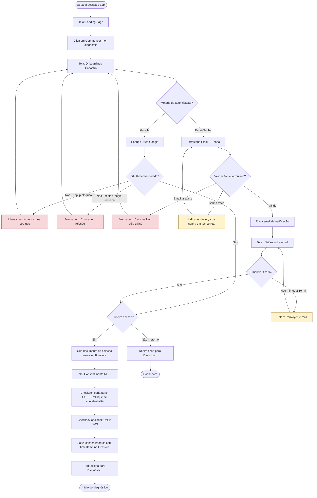
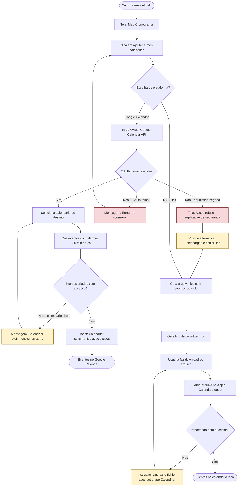
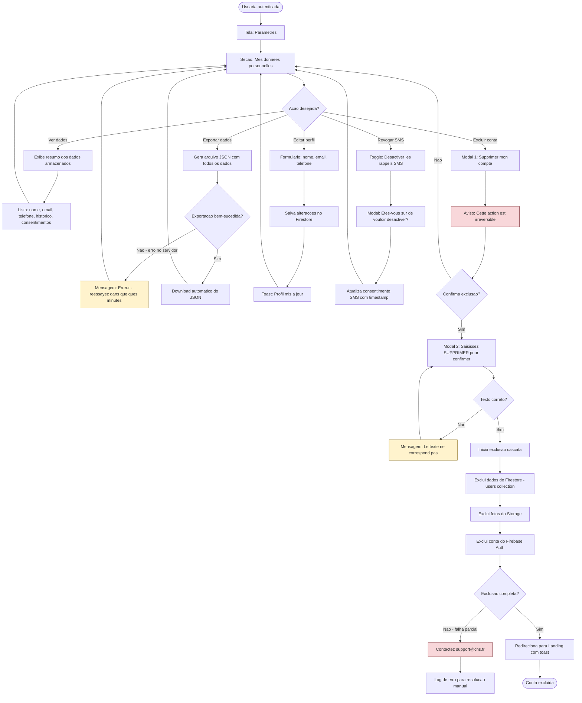
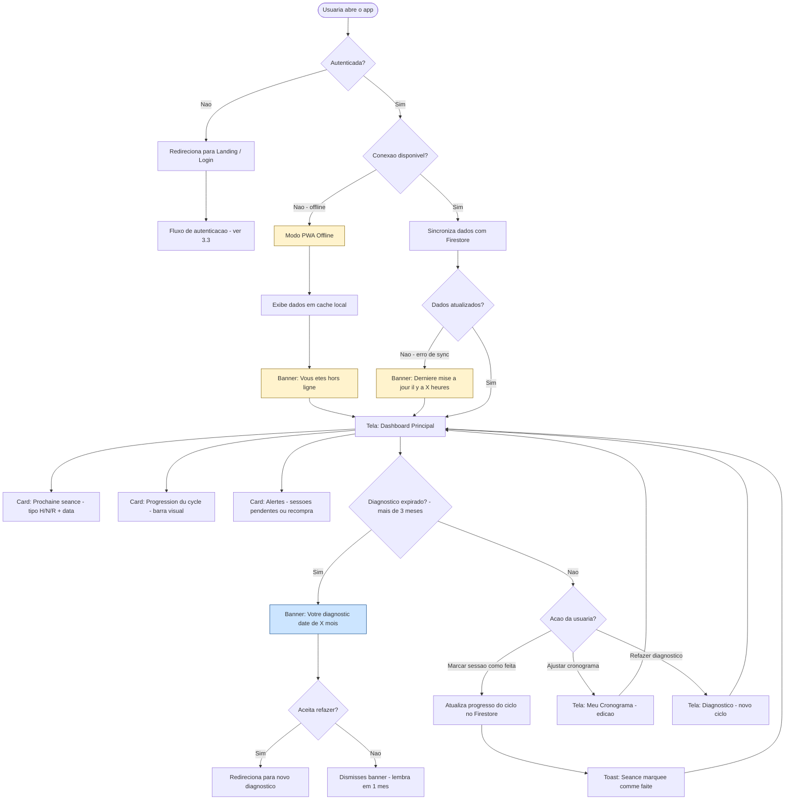

# UX Concept: CronoCapilar (CHS)

## Metadados
- **Baseado em:** 01-product-brief.md, 02-prd.md
- **Data:** 2026-02-06
- **Autor:** AI UX Researcher
- **Versão:** 2.0
- **Atualizado:** 2026-02-07
- **Status:** Aprovado para execução

---

## 1. Estratégia de UX

### 1.1 Visão da Experiência
> "Uma jornada de cuidado capilar sem esforço, onde a tecnologia simplifica a ciência do cronograma e garante a constância através de lembretes invisíveis e integrados à rotina."

### 1.2 Princípios de UX
1. **Clareza Francesa:** Interface limpa, sofisticada e 100% em francês comercial de alta qualidade.
2. **Fricção Mínima:** Do diagnóstico ao calendário em menos de 5 minutos.
3. **Privacidade Transparente:** Consentimento RGPD claro e fácil de gerenciar, gerando confiança.

### 1.3 Métricas de Experiência
| Métrica | Alvo | Como Medir |
|---------|------|-----------|
| Task Success Rate (Diagnóstico) | > 95% | Funil do Firebase |
| Adesão ao Calendário | > 60% | Evento de clique em "Sincronizar" |
| SUS Score (System Usability Scale) | > 80 | Questionário in-app após 1 mês |
| Time to Complete Diagnostic | < 5 min | Cronômetro in-app |
| Drop-off Rate por Etapa | < 15% por etapa | Firebase Analytics funnel |
| Calendar Sync Success Rate | > 80% | Evento de sucesso/falha |
| SMS Click-Through Rate | > 15% | Bit.ly analytics |
| RGPD Opt-in Rate | > 70% | Firestore query |

---

## 2. Arquitetura de Informação

### 2.1 Mapa da Aplicação (Sitemap)



### 2.2 Padrão de Navegação
| Padrão | Justificativa | Lei UX |
|--------|--------------|--------|
| **Mobile-First Bottom Bar** | Facilidade de uso com uma mão em celulares. | Lei de Fitts |
| **Progressive Disclosure** | Questionário de diagnóstico em etapas curtas para não sobrecarregar. | Lei de Hick |

### 2.3 Bottom Navigation Bar
| Posição | Label (FR) | Ícone (Lucide) | Tela |
|---------|-----------|----------------|------|
| 1 | Accueil | `Home` | Dashboard Principal |
| 2 | Diagnostic | `ScanFace` | Diagnóstico IA |
| 3 | Calendrier | `Calendar` | Meu Cronograma |
| 4 | Paramètres | `Settings` | Configurações |

**Comportamento:**
- Item ativo: ícone e label em `--color-gold-500`, peso bold
- Item inativo: ícone e label em `--color-gray-400`
- Altura: 64px (mobile), oculta em desktop (> 1024px)
- Badge de notificação no ícone "Accueil" quando há sessão pendente
- Safe area padding inferior em dispositivos com notch (env(safe-area-inset-bottom))
- Transição de cor: 200ms ease-out

---

## 3. User Flows

### 3.1 Flow: Primeiro Diagnóstico & Configuração do Calendário



---

### 3.2 Flow: Recompra via SMS (Motor de Receita)



**Passos detalhados:**
| Passo | Ação do Sistema | Resposta | Tela | Lei UX |
|-------|----------------|----------|------|--------|
| 1 | CRON verifica estoque | Calcula dias restantes | Backend | N/A |
| 2 | Gera e encurta link | URL trackável | Backend | N/A |
| 3 | Envia SMS personalizado | Mensagem com nome + produto | SMS (+33) | Peak-End Rule |
| 4 | Usuária clica no link | Redirecionamento para loja | Browser mobile | Fitts's Law |
| 5 | Compra realizada | Atualização de estoque | Loja CHS | N/A |

---

### 3.3 Flow: Autenticação e Primeiro Acesso



**Passos detalhados:**
| Passo | Ação do Usuário | Resposta do Sistema | Tela | Lei UX |
|-------|----------------|---------------------|------|--------|
| 1 | Acessa landing page | Exibe hero + CTA | Landing Page | Von Restorff |
| 2 | Clica em CTA principal | Navega para cadastro | Onboarding | Fitts's Law |
| 3 | Escolhe método de auth | Exibe formulário ou popup | Onboarding | Hick's Law |
| 4 | Completa autenticação | Cria perfil / autentica | Backend | Doherty Threshold |
| 5 | Aceita termos RGPD | Salva consentimento | Consentimento | Tesler's Law |
| 6 | Redireciona | Dashboard ou Diagnóstico | Destino | Jakob's Law |

---

### 3.4 Flow: Exportação de Calendário



**Passos detalhados:**
| Passo | Ação do Usuário | Resposta do Sistema | Tela | Lei UX |
|-------|----------------|---------------------|------|--------|
| 1 | Clica em exportar calendário | Exibe opções de plataforma | Cronograma | Hick's Law (2 opções) |
| 2 | Escolhe Google ou iOS | Inicia fluxo correspondente | Modal | Jakob's Law |
| 3 | Autoriza acesso (Google) | Cria eventos com alarmes | OAuth popup | Tesler's Law |
| 4 | Download .ics (iOS) | Gera arquivo compatível | Browser | Postel's Law |
| 5 | Confirma importação | Toast de sucesso | Cronograma | Peak-End Rule |

---

### 3.5 Flow: Gerenciamento RGPD (Dados Pessoais)



**Passos detalhados:**
| Passo | Ação do Usuário | Resposta do Sistema | Tela | Lei UX |
|-------|----------------|---------------------|------|--------|
| 1 | Acessa configurações | Exibe seções de gestão | Paramètres | Miller's Law |
| 2 | Escolhe ação RGPD | Executa operação escolhida | Mes données | Hick's Law |
| 3 | Exporta dados | Download JSON completo | Download | RGPD Art. 20 |
| 4 | Exclui conta | Confirmação dupla + cascata | Modal | Error Prevention |
| 5 | Confirmação final | Exclusão irreversível | Modal 2 | Tesler's Law |

---

### 3.6 Flow: Returning User (Fluxo Recorrente)



**Passos detalhados:**
| Passo | Ação do Usuário | Resposta do Sistema | Tela | Lei UX |
|-------|----------------|---------------------|------|--------|
| 1 | Abre o app | Verifica auth + conectividade | Splash | Doherty Threshold |
| 2 | Visualiza dashboard | Exibe próxima sessão + progresso | Dashboard | Miller's Law |
| 3 | Verifica diagnóstico | Sugere refazer se > 3 meses | Banner | Peak-End Rule |
| 4 | Marca sessão como feita | Atualiza progresso | Toast | Von Restorff |
| 5 | Navega pelo app | Bottom bar sempre acessível | Global | Fitts's Law |

---

### 3.7 Matriz Persona x Fluxo
| Persona | Fluxos Obrigatórios | Resultado Esperado |
|---------|---------------------|--------------------|
| Marie (primária) | Onboarding, Diagnóstico, Cronograma, Sync | concluir diagnóstico em <= 5 min |
| Marc (admin) | Login admin, Dashboard, Export métricas | consultar KPIs em <= 3 cliques |

## 4. Descrições de Tela (Wireframes Textuais)

### 4.1 Tela: Diagnóstico Inteligente (IA)
**Propósito:** Coletar dados precisos para o cronograma.

**Layout:**
```
+--------------------------------------------------+
| [Header: Logo CHS | Barra de Progresso 60%]      |
+--------------------------------------------------+
|                                                  |
|    "Analyse de vos cheveux"                      |
|                                                  |
|    [Área de Dropzone: Envie 2 fotos]             |
|    (Ilustração de exemplo: Foto clara vs Escura) |
|                                                  |
|    [Dica: Tire a foto sob luz natural]           |
|                                                  |
|    [CTA: Analyser mon profil]                    |
|                                                  |
+--------------------------------------------------+
```

### 4.2 Tela: Meu Cronograma
**Propósito:** Visualização e ajuste das sessões.

**Layout:**
```
+--------------------------------------------------+
| [Header: Próxima Sessão: Segunda (Hydratation)]  |
+--------------------------------------------------+
|                                                  |
|    [Mini-Calendário Semanal]                     |
|    L  M  M  J  V  S  D                           |
|    [H] [ ] [N] [ ] [ ] [R] [ ]                   |
|                                                  |
|    [Seção: Personnalisez vos jours]              |
|    - Dias da semana (Selecione 3-4)              |
|    - Horário de aplicação (Input time)           |
|                                                  |
|    [Botão: Ajouter à mon calendrier (iOS/Google)]|
|                                                  |
+--------------------------------------------------+
```

---

### 4.3 Tela: Landing Page
**Propósito:** Conversão de visitantes em usuárias registradas.
**Entrada:** URL direta, busca orgânica, QR code em loja CHS, link em rede social.
**Saída:** Tela de Onboarding/Cadastro (3.3).

**Layout:**
```
+--------------------------------------------------+
| [Header: Logo CHS | "Se connecter" link]         |
+--------------------------------------------------+
|                                                  |
|    [Hero Section]                                |
|    Headline (serif, 28px):                       |
|    "Votre routine capillaire,                    |
|     simplifiée par l'IA"                         |
|                                                  |
|    Subtítulo (sans, 16px):                       |
|    "Diagnostic intelligent, calendrier           |
|     personnalisé et rappels automatiques         |
|     pour des cheveux en pleine santé."           |
|                                                  |
|    [CTA Principal: gold bg, texto preto]         |
|    "Commencer mon diagnostic"                    |
|                                                  |
+--------------------------------------------------+
|                                                  |
|    [3 Benéficios - cards horizontais]            |
|    +----------+ +----------+ +----------+        |
|    | ScanFace | | Calendar | | Bell     |        |
|    |Diagnostic| |Calendrier| |Rappels   |        |
|    |   IA     | |intelligent| |  SMS    |        |
|    +----------+ +----------+ +----------+        |
|                                                  |
+--------------------------------------------------+
|                                                  |
|    [Social Proof]                                |
|    "Plus de 500 clientes CHS utilisent           |
|     CronoCapilar pour leur routine."             |
|                                                  |
|    [Témoignage]                                  |
|    "Grâce à CronoCapilar, je n'oublie plus      |
|     mes soins." — Sophie, 32 ans, Lyon           |
|                                                  |
+--------------------------------------------------+
| [Footer]                                         |
| Mentions légales | Politique de confidentialité  |
| CGU | © 2026 Cosmetic Hair Shop                  |
+--------------------------------------------------+
```

**Elementos:**
| Elemento | Tipo | Comportamento | Prioridade |
|----------|------|---------------|------------|
| Headline hero | Texto serif | Estático, acima do fold | Primário |
| Subtítulo | Texto sans | Estático, complementar | Primário |
| CTA "Commencer" | Botão gold | Navega para Onboarding | Primário |
| Cards de benefício | Card com ícone | Estático, scroll horizontal em mobile | Secundário |
| Social proof | Texto + depoimento | Estático | Terciário |
| Footer legal | Links | Navega para páginas legais | Terciário |

**Estados:**
| Estado | Trigger | Exibição |
|--------|---------|----------|
| Padrão | Acesso normal | Layout completo |
| Authenticated | Já logada | Redireciona para Dashboard |
| Slow connection | Rede lenta | Hero text-first, imagens lazy-load |

---

### 4.4 Tela: Onboarding / Cadastro + RGPD
**Propósito:** Capturar consentimento e dados iniciais para criação de conta.
**Entrada:** CTA da Landing Page, link direto.
**Saída:** Diagnóstico (primeiro acesso) ou Dashboard (retorno).

**Layout:**
```
+--------------------------------------------------+
| [Header: Logo CHS centralizado]                 |
+--------------------------------------------------+
|                                                  |
|    [Título: "Créez votre compte"]                |
|                                                  |
|    [Botão Social - largura total]                |
|    +--------------------------------------+      |
|    |  [G] Se connecter avec Google        |      |
|    +--------------------------------------+      |
|                                                  |
|    [Separador]                                   |
|    -------------- ou ---------------             |
|                                                  |
|    [Formulário Email/Senha]                      |
|    +--------------------------------------+      |
|    | Email                                |      |
|    | ________________________________     |      |
|    | Mot de passe                         |      |
|    | ________________________________     |      |
|    | [Indicador de força: Faible/Fort]    |      |
|    +--------------------------------------+      |
|                                                  |
|    [Consentimentos]                              |
|    [x] J'accepte les conditions d'utilisation    |
|        et la politique de confidentialité *      |
|    [ ] Je souhaite recevoir des rappels par SMS  |
|        (optionnel)                               |
|                                                  |
|    [Link: "Lire la politique de                  |
|     confidentialité"]                            |
|                                                  |
|    [CTA: Créer mon compte]                       |
|    (desabilitado até checkbox obrigatório)        |
|                                                  |
|    [Link: "Déjà un compte ? Se connecter"]       |
|                                                  |
+--------------------------------------------------+
```

**Elementos:**
| Elemento | Tipo | Comportamento | Prioridade |
|----------|------|---------------|------------|
| Botão Google OAuth | Botão social | Abre popup OAuth | Primário |
| Input email | Campo de texto | Validação em tempo real (formato email) | Primário |
| Input senha | Campo de texto | Indicador de força em tempo real | Primário |
| Checkbox CGU | Checkbox obrigatório | Bloqueia CTA se desmarcado | Primário |
| Checkbox SMS | Checkbox opcional | Opt-in para alertas SMS | Secundário |
| Link privacidade | Link texto | Abre página de política | Terciário |
| CTA Criar conta | Botão gold | Desabilitado sem checkbox obrigatório | Primário |

**Estados:**
| Estado | Trigger | Exibição |
|--------|---------|----------|
| Padrão | Acesso normal | Formulário vazio, CTA desabilitado |
| Validação erro | Email inválido/existente | Mensagem vermelha inline |
| Senha fraca | < 8 caracteres | Barra vermelha "Faible" |
| Senha forte | >= 12 chars + especial | Barra verde "Fort" |
| Loading | Processando cadastro | Spinner no CTA, campos desabilitados |
| Sucesso | Conta criada | Redireciona para diagnóstico ou email de verificação |

---

### 4.5 Tela: Questionário de Diagnóstico (Wizard Etapas 1-4)
**Propósito:** Coleta guiada de informações capilares antes do upload de fotos.
**Entrada:** Após cadastro (primeiro acesso) ou menu "Diagnostic" (retorno).
**Saída:** Tela de Upload de Fotos.

**Layout:**
```
+--------------------------------------------------+
| [Header]                                         |
| [<- Retour]              [Étape 2 sur 4]         |
| [Barra de progresso: ========-------- 50%]       |
+--------------------------------------------------+
|                                                  |
|    [Pergunta Principal - 20px bold]              |
|    "Quel est votre type de cheveux ?"            |
|                                                  |
|    [Opções visuais - cards selecionáveis]        |
|    +------------------+ +------------------+     |
|    |   Ilustração     | |   Ilustração     |     |
|    |    "Lisses"      | |    "Ondulés"     |     |
|    +------------------+ +------------------+     |
|    +------------------+ +------------------+     |
|    |   Ilustração     | |   Ilustração     |     |
|    |    "Bouclés"     | |    "Crépus"      |     |
|    +------------------+ +------------------+     |
|                                                  |
+--------------------------------------------------+
| [Footer fixo]                                    |
| [Retour]                    [Continuer ->]       |
+--------------------------------------------------+
```

**Etapas do Wizard:**
| Etapa | Pergunta (FR) | Tipo de Input | Opções |
|-------|--------------|---------------|--------|
| 1 | Quel est votre type de cheveux ? | Cards visuais (single select) | Lisses / Ondulés / Bouclés / Crépus |
| 2 | À quelle fréquence lavez-vous vos cheveux ? | Cards texto (single select) | Tous les jours / 2-3x/semaine / 1x/semaine / Moins souvent |
| 3 | Quels sont vos principaux problèmes capillaires ? | Cards texto (multi select, max 3) | Sécheresse / Casse / Frisottis / Chute / Pellicules / Manque de volume |
| 4 | Quels produits utilisez-vous actuellement ? | Cards texto (multi select) | Shampooing / Après-shampooing / Masque / Huile / Sérum / Aucun |

**Elementos:**
| Elemento | Tipo | Comportamento | Prioridade |
|----------|------|---------------|------------|
| Barra de progresso | Progress bar | Atualiza a cada etapa (25%, 50%, 75%, 100%) | Primário |
| Botão Retour | Botão texto | Volta para etapa anterior | Secundário |
| Pergunta | Texto bold | Uma por etapa | Primário |
| Cards de opção | Card selecionável | Borda gold quando selecionado | Primário |
| Botão Continuer | Botão gold | Desabilitado até seleção | Primário |

**Estados:**
| Estado | Trigger | Exibição |
|--------|---------|----------|
| Padrão | Nenhuma seleção | Cards neutros, Continuer desabilitado |
| Seleção ativa | Card clicado | Borda gold + check, Continuer habilitado |
| Última etapa | Etapa 4 | Continuer muda para "Passer aux photos" |
| Retorno ao wizard | Diagnóstico anterior | Cards pré-selecionados com respostas anteriores |

---

### 4.6 Tela: Resultado do Diagnóstico
**Propósito:** Exibir resultado da análise IA e gerar confiança na recomendação.
**Entrada:** Processamento Gemini concluído com sucesso.
**Saída:** Tela de configuração do cronograma.

**Layout:**
```
+--------------------------------------------------+
| [Header: "Votre diagnostic capillaire"]          |
+--------------------------------------------------+
|                                                  |
|    [Ilustração do tipo de cabelo - SVG]          |
|    (Ex: ondas suaves para "Ondulés")             |
|                                                  |
|    [Card Principal - borda gold]                 |
|    +--------------------------------------+      |
|    | Type identifié:                      |      |
|    | "Cheveux secs - Porosité moyenne"    |      |
|    |                                      |      |
|    | Résumé:                              |      |
|    | "Vos cheveux montrent des signes     |      |
|    |  de déshydratation avec une          |      |
|    |  porosité moyenne, ce qui            |      |
|    |  signifie qu'ils absorbent           |      |
|    |  l'hydratation mais la perdent       |      |
|    |  rapidement."                        |      |
|    +--------------------------------------+      |
|                                                  |
|    [Recomendação - destaque visual]              |
|    +--------------------------------------+      |
|    | Nous vous recommandons de prioriser  |      |
|    | l'Hydratation (H)                    |      |
|    +--------------------------------------+      |
|                                                  |
|    [Preview do Ciclo Semanal]                    |
|    "Votre plan de traitement suggéré :"          |
|    L:H  M:--  M:N  J:--  V:--  S:R  D:--        |
|    (3 séances/semaine)                           |
|                                                  |
|    [CTA Principal: gold bg, texto preto]         |
|    "Configurer mon calendrier"                   |
|                                                  |
|    [Link secundário]                             |
|    "Refaire le diagnostic"                       |
|                                                  |
+--------------------------------------------------+
```

**Elementos:**
| Elemento | Tipo | Comportamento | Prioridade |
|----------|------|---------------|------------|
| Ilustração tipo capilar | SVG / imagem | Dinâmica baseada no resultado IA | Secundário |
| Card resultado | Card com borda | Exibe tipo + resumo acessível | Primário |
| Recomendação H/N/R | Card destaque | Prioridade do tratamento | Primário |
| Preview ciclo semanal | Linha visual | H/N/R em dias da semana | Secundário |
| CTA configurar | Botão gold | Navega para configuração de cronograma | Primário |
| Link refazer | Link texto | Volta ao início do diagnóstico | Terciário |

**Estados:**
| Estado | Trigger | Exibição |
|--------|---------|----------|
| Sucesso | IA processou com sucesso | Resultado completo + recomendação |
| Erro IA | Falha no processamento | Mensagem de erro + botão réessayer |
| Loading | Aguardando IA | Animação com "facts capilares" |
| Diagnóstico anterior | Retorno ao resultado salvo | Exibe último resultado + data |

---

### 4.7 Tela: Configurações / RGPD
**Propósito:** Gestão de conta, notificações e dados pessoais em conformidade RGPD.
**Entrada:** Bottom Bar item "Paramètres".
**Saída:** Ações de configuração (editar, exportar, excluir).

**Layout:**
```
+--------------------------------------------------+
| [Header: "Paramètres"]                           |
+--------------------------------------------------+
|                                                  |
|    [Seção: Mon profil]                           |
|    +--------------------------------------+      |
|    | Nom         Marie Dupont    [>]      |      |
|    | Email       marie@email.fr  [>]      |      |
|    | Téléphone   +33 6 12 34 56  [>]      |      |
|    +--------------------------------------+      |
|                                                  |
|    [Seção: Notifications]                        |
|    +--------------------------------------+      |
|    | Rappels SMS          [==== ON ]      |      |
|    | Notifications email  [==== ON ]      |      |
|    +--------------------------------------+      |
|                                                  |
|    [Seção: Mes données]                          |
|    +--------------------------------------+      |
|    | [v] Télécharger mes données          |      |
|    |     (format JSON)                    |      |
|    |                                      |      |
|    | [x] Supprimer mon compte             |      |
|    |     (texto vermelho)                 |      |
|    +--------------------------------------+      |
|                                                  |
|    [Seção: À propos]                             |
|    +--------------------------------------+      |
|    | Version de l'app      1.0.0          |      |
|    | Mentions légales           [>]       |      |
|    | Politique de confidentialité [>]     |      |
|    | CGU                        [>]       |      |
|    +--------------------------------------+      |
|                                                  |
+--------------------------------------------------+
| [Bottom Bar: Accueil | Diagnostic |              |
|  Calendrier | *Paramètres]                       |
+--------------------------------------------------+
```

**Modal de Exclusão de Conta:**
```
+--------------------------------------------------+
| [Overlay escuro 60% opacidade]                   |
|                                                  |
|    +--------------------------------------+      |
|    | (!) Supprimer mon compte              |      |
|    |                                      |      |
|    | Cette action est irréversible.       |      |
|    | Toutes vos données seront            |      |
|    | supprimées :                          |      |
|    | - Votre profil et préférences        |      |
|    | - Votre historique de diagnostics    |      |
|    | - Vos photos                         |      |
|    | - Votre calendrier                   |      |
|    |                                      |      |
|    | Saisissez SUPPRIMER pour             |      |
|    | confirmer :                           |      |
|    | ________________________________     |      |
|    |                                      |      |
|    | [Annuler]    [Supprimer - rouge]     |      |
|    +--------------------------------------+      |
|                                                  |
+--------------------------------------------------+
```

**Elementos:**
| Elemento | Tipo | Comportamento | Prioridade |
|----------|------|---------------|------------|
| Campos do perfil | Lista editável | Toque para editar inline | Primário |
| Toggle SMS | Switch | On/Off com modal de confirmação para desativar | Primário |
| Toggle email | Switch | On/Off imediato | Secundário |
| Botão exportar | Botão com ícone | Gera e baixa JSON dos dados | Secundário |
| Botão excluir | Botão texto vermelho | Abre modal de confirmação dupla | Terciário |
| Links legais | Lista de navegação | Navega para páginas estáticas | Terciário |

**Estados:**
| Estado | Trigger | Exibição |
|--------|---------|----------|
| Padrão | Acesso normal | Dados do perfil + toggles |
| Editando | Clique em campo | Input editável inline + botão "Enregistrer" |
| Exportando | Clique em exportar | Spinner + "Préparation du fichier..." |
| Modal exclusão | Clique em excluir | Modal com confirmação dupla |
| Processando exclusão | Confirmou "SUPPRIMER" | Spinner + "Suppression en cours..." |

---

## 5. Mapa de Fricção

| Fluxo | Passo | Tipo | Severidade (1-5) | Causa | Solução |
|-------|-------|------|------------------|-------|---------|
| Diagnóstico | Upload de Foto | Técnica | 4 | Usuária envia foto ruim/escura | Modal com guia visual e exemplos reais de "bom vs ruim" |
| Diagnóstico | Tempo de processamento IA | Temporal | 4 | Gemini pode levar 10-15s para análise | Animação de loading com "facts capilares" para manter engajamento |
| Diagnóstico | Questionário 7 perguntas | Cognitiva | 3 | Fadiga de formulário longo | Progressive disclosure em 4 etapas curtas (max 2 perguntas/etapa) |
| Diagnóstico | Interpretar resultado H/N/R | Cognitiva | 3 | Terminologia técnica de cronograma capilar | Micro-onboarding visual explicando H/N/R com linguagem simples e ícones |
| Diagnóstico | Câmera não disponível (desktop) | Técnica | 2 | Usuárias em desktop não têm câmera frontal fácil | Opção de upload de arquivo + instrução para usar foto do celular |
| Cadastro | Formato telefone +33 | Interação | 3 | Formato internacional confunde usuárias | Input com máscara automática e prefixo +33 pré-preenchido |
| Cadastro | Consentimento RGPD | Cognitiva | 3 | Texto legal em francês jurídico | Resumo em linguagem simples + link para texto completo |
| Sincronização | Login Google (OAuth) | Interação | 3 | Processo de autorização complexo com múltiplos passos | Explicação clara do porquê o acesso ao calendário é necessário |
| Sincronização | Permissão negada Google | Emocional | 4 | Medo de privacidade e compartilhamento de dados | Tela de fallback com opção .ics + explicação de segurança |
| Cronograma | Selecionar 3-4 dias da semana | Interação | 2 | Decisão de agenda sem referência | Sugestão pré-selecionada baseada em frequência ideal do diagnóstico |
| Recompra | Receber SMS de marca | Emocional | 3 | Percepção de spam comercial | Tom pessoal ("Marie, votre masque arrive à sa fin"), opção de desativação visível |
| Retorno | Lembrar que o app existe | Acesso | 3 | PWA não tem presença nativa no celular | Incentivo para "Add to Home Screen" no primeiro acesso + instrução visual |
| Geral | Encontrar opção de deletar conta | Interação | 2 | Deve ser acessível mas não proeminente | Menu de configurações com seção "Mes données" clara e acessível |
| Geral | Primeira vez no app - tela vazia | Emocional | 3 | Dashboard sem dados gera sensação de produto vazio | Estado empty com ilustração + CTA "Faire mon diagnostic" |

---

## 6. Acessibilidade (WCAG 2.1 AA)

### 6.1 Checklist de Conformidade
| Critério | Requisito | Status | Sprint alvo | Dono |
|----------|-----------|:------:|------------|------|
| **1.1.1** | Alt text em imagens | 🟨 Planejado | AG-Sprint-1 | Frontend |
| **1.3.1** | Estrutura semântica | 🟨 Planejado | AG-Sprint-1 | Frontend |
| **1.4.3** | Contraste mínimo 4.5:1 | 🟨 Planejado | AG-Sprint-0 | Frontend |
| **1.4.11** | Contraste não-texto 3:1 | 🟨 Planejado | AG-Sprint-0 | Frontend |
| **2.1.1** | Navegação por teclado | 🟨 Planejado | AG-Sprint-1 | Frontend |
| **2.4.4** | Propósito do link | 🟨 Planejado | AG-Sprint-1 | Frontend |
| **2.4.6** | Headings descritivos | 🟨 Planejado | AG-Sprint-1 | Frontend |
| **3.3.1** | Identificação de erro | 🟨 Planejado | AG-Sprint-1 | Frontend |
| **3.3.2** | Labels em formulários | 🟨 Planejado | AG-Sprint-1 | Frontend |
| **4.1.2** | ARIA landmarks | 🟨 Planejado | AG-Sprint-1 | Frontend |

### 6.2 Requisitos Específicos
- **Contraste:** Uso de cores da marca CHS com contraste mínimo de 4.5:1 para texto normal, 3:1 para texto grande.
- **Idiomas:** Atributo `lang="fr-FR"` no HTML root; suporte a leitores de tela em francês.
- **Interações:** Botões com área mínima de toque de 48x48px (mobile) e 44x44px (desktop).
- **Focus States:** Outline visível de 2px em elementos focáveis (cor: `--color-gold-500`).
- **Skip Links:** Link "Aller au contenu principal" no início da página.

---

## 7. GAP Analysis: Experiência do Usuário

### 7.1 Flow Assessment
| User Flow | Estado Atual | Estado Ideal | Fricções | Severidade |
|-----------|-------------|-------------|----------|------------|
| Diagnóstico Foto | Novo (Greenfield) | Análise imediata | Qualidade da câmera do usuário | High |
| Sync iOS | Novo (Greenfield) | Um clique (.ics) | Permissões do sistema iOS | Medium |

### 7.2 GAP Inventory
| ID | Área | AS-IS | TO-BE | GAP | Severidade | Prioridade |
|----|------|-------|-------|-----|------------|------------|
| G-UX-01 | Foto Instrução | Sem guia | Guia Visual | Falta de assets gráficos educativos | Medium | P1 |
| G-UX-02 | Idioma | Sem conteúdo | 100% Francês | Tradução técnica de termos capilares | Medium | P0 |

---

## 8. Estados de Tela

### 8.1 Matriz de Estados por Tela
| Tela | Empty | Loading | Success | Error | Partial |
|------|:-----:|:-------:|:-------:|:-----:|:-------:|
| **Landing Page** | N/A | N/A | Padrão | N/A | N/A |
| **Diagnóstico IA** | Sem fotos enviadas | Processando IA | Resultado exibido | Falha na análise | Upload parcial |
| **Meu Cronograma** | Sem cronograma ativo | Carregando dados | Calendário exibido | Erro de sync | Dias incompletos |
| **Sincronização** | Sem calendário | Conectando OAuth | Exportado com sucesso | Permissão negada | N/A |

### 8.2 Especificação de Estados Críticos

#### Diagnóstico - Estado de Erro
- **Trigger:** Foto com qualidade insuficiente ou timeout da IA
- **UI:** Banner vermelho com ícone de alerta + mensagem amigável
- **Copy (FR):** "Nous n'avons pas pu analyser votre photo. Essayez à nouveau avec une meilleure lumière."
- **Ação:** Botão "Réessayer" + link "Voir conseils photo"

#### Calendário - Estado Empty
- **Trigger:** Usuária nova sem diagnóstico
- **UI:** Ilustração vazia + CTA primário
- **Copy (FR):** "Votre calendrier est vide. Commencez par faire votre diagnostic capillaire."
- **Ação:** Botão "Faire mon diagnostic"

---

## 9. Avaliação Heurística (Nielsen's 10)

| # | Heurística | Avaliação | Evidência | Severidade |
|---|-----------|:---------:|-----------|:----------:|
| 1 | **Visibilidade do Status** | ✅ | Barra de progresso no diagnóstico; estados claros de loading | 0 |
| 2 | **Correspondência com Mundo Real** | ✅ | Terminologia de salon (H/N/R) familiar às clientes CHS | 0 |
| 3 | **Controle e Liberdade** | ⚠️ | Falta botão "voltar" em algumas etapas do questionário | 2 |
| 4 | **Consistência e Padrões** | ✅ | Uso de shadcn/ui garante padrões visuais | 0 |
| 5 | **Prevenção de Erros** | ⚠️ | Modal de confirmação antes de deletar conta (RGPD) | 1 |
| 6 | **Reconhecimento > Memorização** | ✅ | Ícones visuais para cada tipo de tratamento (H/N/R) | 0 |
| 7 | **Flexibilidade e Eficiência** | ✅ | Ajuste de dias/horários no cronograma | 0 |
| 8 | **Design Minimalista** | ✅ | Interface premium e limpa (vide Design System) | 0 |
| 9 | **Recuperação de Erros** | ⚠️ | Mensagens de erro genéricas em alguns formulários | 2 |
| 10 | **Ajuda e Documentação** | ⚠️ | Falta seção FAQ ou tooltips contextuais | 2 |

**Escala de Severidade:** 0 = Sem problema | 1 = Cosmético | 2 = Menor | 3 = Maior | 4 = Catastrófico

### 9.1 Ações Recomendadas
1. Adicionar botão "Retour" em todas as etapas do questionário (Heurística 3)
2. Implementar mensagens de erro específicas com sugestão de correção (Heurística 9)
3. Criar tooltips "?" nos campos complexos e FAQ básico (Heurística 10)

---

## 10. Plano de Validação UX por Sprint
| Sprint | Cenários de Teste | Critério de Aprovação |
|--------|-------------------|------------------------|
| AG-Sprint-0 | Navegação base, i18n FR, layout mobile | 0 bloqueios críticos de navegação |
| AG-Sprint-1 | Diagnóstico completo, cronograma, mensagens de erro | Task success >= 95% no fluxo principal |
| Pré-release | Teste de usabilidade moderado (5 usuárias) | SUS >= 80 e taxa de erro <= 5% |
