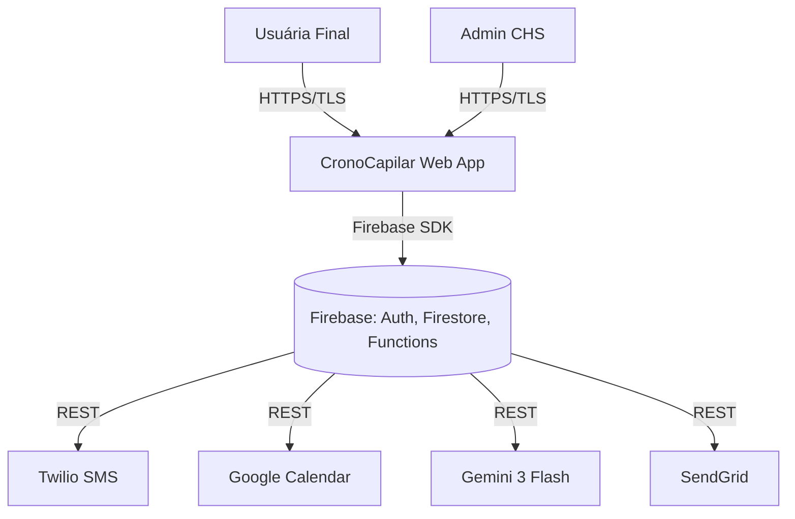
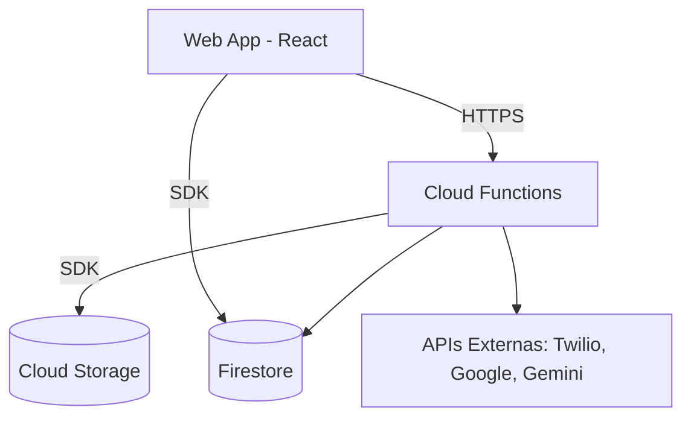

# Architecture: CronoCapilar (CHS)

## Metadados
- **Baseado em:** Brief, PRD, UX Concept
- **Data:** 2026-02-06
- **Versão:** 1.1
- **Status:** Aprovado para execução

---

## 1. System Context (C4 Level 1)

### 1.1 Atores
| Ator | Tipo | Descrição | Interação |
|------|------|-----------|-----------|
| **Usuária Final** | Pessoa | Mulher francesa (18-45 anos) | Realiza diagnósticos, configura cronograma e recebe alertas. |
| **Admin CHS** | Pessoa | Gerente de loja/Administrador | Visualiza métricas de conversão e recompras no dashboard. |
| **Sistema CronoCapilar** | Software | Web App + Backend | Processa a lógica do cronograma e integra com APIs. |

### 1.2 Sistemas Externos
| Sistema | Protocolo | Dados Trocados |
|---------|----------|----------------|
| **Firebase Auth** | SDK/HTTPS | Credenciais de usuário e tokens JWT. |
| **Firestore** | SDK/HTTPS | Dados persistidos (diagnósticos, cronogramas). |
| **Twilio SMS** | REST API | Mensagens de alerta (+33) e links de recompra. |
| **Google Calendar** | REST API | Eventos e alarmes de tratamento. |
| **Gemini 3 Flash** | Vertex AI API | Fotos capilares (input) -> Análise técnica (output). |
| **SendGrid** | REST API | E-mails de fallback e boas-vindas. |
| **Bit.ly** | REST API | Links encurtados para rastreamento de cliques no SMS. |

### 1.3 Diagrama de Contexto


---

## 2. Container Diagram (C4 Level 2)

| Container | Tecnologia | Propósito | Comunica Com |
|-----------|------------|---------|--------------|
| **Web Frontend** | React 19 + TypeScript + Vite | Interface do usuário mobile-first. | Firebase Functions, Firestore. |
| **Backend Functions** | Node.js (Cloud Functions) | Lógica de negócio, integrações, processamento IA. | Firestore, Gemini, Twilio, SendGrid. |
| **Database** | Firestore (NoSQL) | Armazenamento de usuários, diagnósticos e logs. | Cloud Functions, Web App. |
| **Cloud Storage** | Firebase Storage | Armazenamento das fotos de diagnóstico. | Cloud Functions, Web App. |



---

## 3. Padrão Arquitetural

### 3.1 Decisões
| Aspecto | Decisão | Justificativa |
|---------|---------|---------------|
| **Padrão** | Serverless Architecture | Escalabilidade automática e custo reduzido para o MVP na CHS. |
| **Comunicação** | Firebase SDK + Cloud Functions | Integração nativa e segurança (App Check). |
| **Renderização** | SPA (Vite) | Melhor UX em mobile para single page journeys. |

### 3.2 ADRs

#### ADR-001: Firebase Região Europeia
**Status:** Accepted
**Contexto:** O projeto opera na França e precisa de conformidade total com o RGPD.
**Decisão:** Utilizar a região `europe-west1` (Bélgica) para Firestore e Cloud Functions.
**Alternativas:**
| Alternativa | Prós | Contras | Motivo Rejeição |
|------------|------|---------|-----------------|
| US-Central1 | Menor latência global | Violação do RGPD (dados fora da UE) | Compliance legal obrigatório na França. |
**Consequências:** Conformidade legal garantida e latência mínima para usuárias francesas.

#### ADR-002: Firebase Hosting para Frontend
**Status:** Accepted
**Contexto:** O frontend precisa de hosting com baixa latência na Europa e integração com Cloud Functions.
**Decisão:** Utilizar Firebase Hosting em vez de Vercel para o frontend.
**Alternativas:**
| Alternativa | Prós | Contras | Motivo Rejeição |
|------------|------|---------|-----------------|
| Vercel Edge | CDN global, boa DX | Dois provedores, CORS entre domínios, deploy separado | Complexidade operacional desnecessária para MVP. |
**Consequências:** Deploy unificado via `firebase deploy`, sem CORS, infraestrutura simplificada. Migrar para Vercel no futuro se necessário.

#### ADR-003: Pre-rendering da Landing Page
**Status:** Accepted
**Contexto:** A landing page precisa de SEO para aquisicao organica, mas o restante do app (diagnostico, dashboard) e protegido por autenticacao e nao precisa de indexacao.
**Decisao:** Utilizar `vite-ssg` (Static Site Generation) para pre-renderizar apenas a landing page (`/`) e as paginas publicas (`/mentions-legales`, `/politique-de-confidentialite`). As demais rotas permanecem como SPA.
**Alternativas:**
| Alternativa | Pros | Contras | Motivo Rejeicao |
|------------|------|---------|-----------------|
| Next.js (SSR completo) | SEO excelente em todas as paginas | Over-engineering para um app 95% autenticado; complexidade de migracao de Vite. | Complexidade desnecessaria. |
| SPA puro (sem SSR) | Simplicidade maxima | Landing page nao indexada pelo Google; perda de aquisicao organica. | Impacto negativo em SEO. |
| Landing page separada (HTML estatico) | SEO perfeito, zero dependencia | Dois projetos para manter, inconsistencia visual, deploy separado. | Overhead de manutencao. |
**Consequencias:** SEO otimizado para paginas publicas com minimo impacto na arquitetura. Build gera HTMLs estaticos para rotas publicas e bundle SPA para rotas autenticadas.

---

## 4. Database Design (Firestore)

### 4.1 Coleções Principais

#### Coleção: `users`
| Campo | Tipo | Descrição |
|-------|------|-----------|
| uid | String (PK) | ID do Firebase Auth |
| email | String | E-mail da usuária |
| phoneNumber | String | Número E.164 (ex: +33612345678) para SMS |
| firstName | String | Nome para personalização |
| lastName | String | Sobrenome para personalização |
| locale | String | Idioma preferido (default: "fr-FR") |
| region | String | Ex: "europe-west1" |
| createdAt | Timestamp | Data de cadastro |
| updatedAt | Timestamp | Última atualização do perfil |
| optInSMS | Boolean | Consentimento para SMS |

#### Coleção: `diagnostics`
| Campo | Tipo | Descrição |
|-------|------|-----------|
| id | String (PK) | ID do diagnóstico |
| userId | String (FK) | Referência ao usuário |
| hairType | String | Resultado da análise (Dry, Oily, etc.) |
| porosity | String | Nível de porosidade (low/medium/high) |
| recommendedAction | String | Ação recomendada pela IA |
| technicalSummary | String | Resumo técnico da análise |
| photoUrls | Array | Links das fotos no Storage |
| status | String | `pending` ou `completed` |
| analyzedAt | Timestamp | Data da análise pela IA |
| createdAt | Timestamp | Data de criação do diagnóstico |
| geminiModelVersion | String | Versão do modelo usado |

#### Coleção: `schedules`
| Campo | Tipo | Descrição |
|-------|------|-----------|
| id | String (PK) | ID do cronograma |
| userId | String (FK) | Referência ao usuário |
| diagnosticId | String (FK) | Referência ao diagnóstico que gerou o cronograma |
| sequence | Array | Lista de H/N/R planejada |
| daysOfWeek | Array | [1, 3, 6] (seg, qua, sab) |
| time | String | "20:00" |
| startAt | Timestamp | Data de início do ciclo |
| status | String | "active" ou "completed" ou "paused" |
| createdAt | Timestamp | Data de criação |
| updatedAt | Timestamp | Última atualização |

#### Coleção: `products`
| Campo | Tipo | Descrição |
|-------|------|-----------|
| id | String (PK) | ID do produto |
| userId | String (FK) | Referência ao usuário |
| name | String | Nome do produto (ex: "Masque Hydratation CHS 300ml") |
| type | String | Tipo: "hydration", "nutrition", "reconstruction" |
| totalVolumeMl | Number | Volume total da embalagem em ml |
| usagePerSessionMl | Number | Consumo estimado por sessão (default: 15ml) |
| sessionsCompleted | Number | Sessões já realizadas |
| purchasedAt | Timestamp | Data da compra |
| estimatedDepletion | Timestamp | Data estimada de esgotamento |
| status | String | "in_use", "depleted", "replaced" |

#### Coleção: `notifications`
| Campo | Tipo | Descrição |
|-------|------|-----------|
| id | String (PK) | ID da notificação |
| userId | String (FK) | Referência ao usuário |
| type | String | "rebuy_alert", "treatment_reminder", "welcome" |
| channel | String | "sms" ou "email" |
| status | String | "pending", "sent", "delivered", "failed" |
| sentAt | Timestamp | Data/hora do envio |
| bitlyLink | String | Link encurtado (se aplicável) |
| clickedAt | Timestamp | Data/hora do clique (null se não clicado) |
| errorMessage | String | Mensagem de erro (se falhou) |

#### Coleção: `analytics`
| Campo | Tipo | Descrição |
|-------|------|-----------|
| date | String (PK) | Data no formato YYYY-MM-DD |
| totalDiagnostics | Number | Diagnósticos realizados no dia |
| totalSMSSent | Number | SMS enviados no dia |
| smsDelivered | Number | SMS entregues com sucesso |
| smsFailed | Number | SMS que falharam |
| bitlyClicks | Number | Cliques em links de recompra |
| newUsers | Number | Novos cadastros |
| activeSchedules | Number | Cronogramas ativos |

### 4.2 Índices Compostos (Firestore)
| Coleção | Campos | Tipo |
|---------|--------|------|
| `diagnostics` | userId ASC, createdAt DESC | Composite |
| `schedules` | userId ASC, status ASC, startAt DESC | Composite |
| `products` | userId ASC, status ASC, estimatedDepletion ASC | Composite |
| `notifications` | userId ASC, sentAt DESC | Composite |
| `notifications` | type ASC, status ASC, sentAt ASC | Composite |

---

## 5. Integrações e Data Flow

### 5.1 Inventário
| Integração | Propósito | Protocolo | Auth | Fallback |
|-----------|---------|----------|------|----------|
| **Twilio** | SMS de recompra | REST | Auth Token | E-mail (SendGrid) |
| **Gemini 3 Flash** | Análise de Foto | Vertex AI | Service Account | Diagnóstico Textual |
| **Google Calendar** | Sincronização | REST | OAuth2 | Arquivo .ics |

### 5.2 Data Flow: Alerta de Recompra
1. **Trigger:** Cloud Function agendada (Cron) roda diariamente.
2. **Cálculo:** Função verifica `schedules` ativos e calcula consumo baseado em 15ml por sessão.
3. **Detecção:** Se o estoque virtual < 5 dias, busca `uid` e `phoneNumber`.
4. **Resumo:** Encurta link da loja via **Bit.ly**.
5. **Execução:** Envia SMS via **Twilio**.

---

## 6. Segurança

### 6.1 Autenticação e Autorização
| Aspecto | Decisão | Justificativa |
|---------|---------|---------------|
| **Método** | Firebase Auth (Google + E-mail) | Segurança robusta e facilidade de implementação. |
| **Modelo** | Firestore Security Rules | Proteção granular de dados baseada em `request.auth.uid`. |

### 6.2 Checklist
- [x] Firebase App Check para evitar abuso de APIs.
- [x] Firestore Rules: Usuária só lê/escreve no próprio `uid`.
- [x] HTTPS obrigatório em todos os endpoints.
- [x] Criptografia de fotos no Firebase Storage.

### 6.3 Firestore Security Rules

```javascript
rules_version = '2';

service cloud.firestore {
  match /databases/{database}/documents {

    // Helper: check if user is authenticated
    function isAuthenticated() {
      return request.auth != null;
    }

    // Helper: check if user owns the document
    function isOwner(userId) {
      return isAuthenticated() && request.auth.uid == userId;
    }

    // Helper: check if user has admin role
    function isAdmin() {
      return isAuthenticated() && request.auth.token.role == 'admin_chs';
    }

    // Helper: validate string field
    function isValidString(field) {
      return field is string && field.size() > 0 && field.size() < 1000;
    }

    // Helper: validate phone number format (E.164)
    function isValidPhone(phone) {
      return phone is string && phone.matches('^\\+[1-9]\\d{1,14}$');
    }

    // ==========================================
    // Collection: users
    // ==========================================
    match /users/{userId} {
      // Users can read their own profile
      allow read: if isOwner(userId);

      // Users can create their own profile (first login)
      allow create: if isOwner(userId)
        && request.resource.data.keys().hasAll(['email', 'firstName', 'createdAt'])
        && isValidString(request.resource.data.email);

      // Users can update their own profile (limited fields)
      allow update: if isOwner(userId)
        && request.resource.data.diff(resource.data).affectedKeys()
          .hasOnly(['firstName', 'lastName', 'phoneNumber', 'locale', 'optInSMS', 'updatedAt']);

      // Users can delete their own profile (RGPD right to erasure)
      allow delete: if isOwner(userId);

      // Admins can read any user profile (for support)
      allow read: if isAdmin();
    }

    // ==========================================
    // Collection: diagnostics
    // ==========================================
    match /diagnostics/{diagnosticId} {
      // Users can read their own diagnostics
      allow read: if isAuthenticated()
        && resource.data.userId == request.auth.uid;

      // Users can create diagnostics for themselves
      allow create: if isAuthenticated()
        && request.resource.data.userId == request.auth.uid
        && request.resource.data.keys().hasAll(['userId', 'photoUrls', 'status', 'createdAt']);

      // Only Cloud Functions can update diagnostics (via Admin SDK)
      // Users cannot modify diagnostic results
      allow update: if false;

      // Users can delete their own diagnostics (RGPD)
      allow delete: if isAuthenticated()
        && resource.data.userId == request.auth.uid;
    }

    // ==========================================
    // Collection: schedules
    // ==========================================
    match /schedules/{scheduleId} {
      // Users can read their own schedules
      allow read: if isAuthenticated()
        && resource.data.userId == request.auth.uid;

      // Users can create schedules for themselves
      allow create: if isAuthenticated()
        && request.resource.data.userId == request.auth.uid
        && request.resource.data.keys().hasAll(['userId', 'diagnosticId', 'sequence', 'daysOfWeek', 'time', 'startAt', 'status', 'createdAt']);

      // Users can update their own schedules (adjust days/time)
      allow update: if isAuthenticated()
        && resource.data.userId == request.auth.uid
        && request.resource.data.diff(resource.data).affectedKeys()
          .hasOnly(['daysOfWeek', 'time', 'status', 'updatedAt']);

      // Users can delete their own schedules (RGPD)
      allow delete: if isAuthenticated()
        && resource.data.userId == request.auth.uid;
    }

    // ==========================================
    // Collection: products
    // ==========================================
    match /products/{productId} {
      // Users can read their own products
      allow read: if isAuthenticated()
        && resource.data.userId == request.auth.uid;

      // Users can create products for themselves
      allow create: if isAuthenticated()
        && request.resource.data.userId == request.auth.uid;

      // Only Cloud Functions update products (sessions count, depletion calc)
      allow update: if false;

      // Users can delete their own products (RGPD)
      allow delete: if isAuthenticated()
        && resource.data.userId == request.auth.uid;
    }

    // ==========================================
    // Collection: notifications
    // ==========================================
    match /notifications/{notificationId} {
      // Users can read their own notifications
      allow read: if isAuthenticated()
        && resource.data.userId == request.auth.uid;

      // Only Cloud Functions create/update notifications (via Admin SDK)
      allow create, update: if false;

      // Users can delete their own notifications (RGPD)
      allow delete: if isAuthenticated()
        && resource.data.userId == request.auth.uid;
    }

    // ==========================================
    // Collection: analytics
    // ==========================================
    match /analytics/{date} {
      // Only admins can read analytics
      allow read: if isAdmin();

      // Only Cloud Functions write analytics (via Admin SDK)
      allow create, update, delete: if false;
    }

    // ==========================================
    // Deny all other access by default
    // ==========================================
    match /{document=**} {
      allow read, write: if false;
    }
  }
}
```

**Notas de implementacao:**
- Cloud Functions usam Admin SDK (bypassa rules) para operacoes de backend (analise IA, calculo de estoque, envio de notificacoes).
- As rules devem ser testadas com Firebase Emulator Suite antes do deploy.
- Campos imutaveis (como `userId`, `createdAt`) sao protegidos pela restricao `affectedKeys().hasOnly()`.

---

## 7. Infraestrutura

### 7.1 Ambientes
| Ambiente | Hosting | Região | Deploy |
|----------|---------|--------|--------|
| **Development** | Local emuladores Firebase | local | Manual |
| **Staging** | Firebase Hosting (staging) | `europe-west1` | Merge para `develop` |
| **Production** | Firebase Hosting (prod) | `europe-west1` | Merge para `main` |

### 7.2 Observabilidade e SLOs
| SLI | Meta (SLO) | Fonte |
|-----|------------|-------|
| Latência APIs core (p95) | < 200 ms | Firebase Performance |
| Taxa de erro APIs core | < 1% | Cloud Monitoring |
| Entrega de SMS | >= 90% | Twilio Delivery Logs |
| Uptime frontend | >= 99.5% | Uptime Checks |

### 7.3 Backup, DR e Continuidade
- **RPO alvo:** 24 horas para dados operacionais.
- **RTO alvo:** 4 horas para restauração de serviço crítico.
- **Backup lógico diário** das coleções críticas (`users`, `diagnostics`, `schedules`, `products`).
- **Runbook de restauração** versionado e testado trimestralmente.

---

## 8. GAP Analysis: Infraestrutura

### 8.1 Architecture Assessment
| Componente | Atual | Necessário | GAP | Esforço |
|-----------|-------|-----------|-----|---------|
| IA Analysis | Greenfield | Integração Gemini | Prompt Engineering & Response Parsing | Médio |
| Calendar Sync | Greenfield | Google/iCloud Sync | OAuth Flow & ICS Generator | Médio |

### 8.2 Scalability Assessment
O modelo serverless do Firebase escala conforme o uso das lojas CHS, suportando picos de diagnósticos pós-campanhas de SMS sem intervenção manual.

### 8.3 GAP Inventory
| ID | Área | AS-IS | TO-BE | GAP | Severidade | Prioridade |
|----|------|-------|-------|-----|------------|------------|
| G-ARCH-01 | Compliance | Sem Infra | Firebase Europa | Configurar projeto em `europe-west1` | Alta | P0 |
| G-ARCH-02 | Analytics | Sem Logs | Dashboard Admin | Criar Cloud Function de agregação | Média | P1 |
