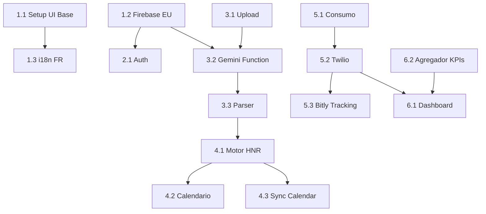

# Backlog: CronoCapilar (CHS)

## Metadados
- **Baseado em:** Brief, PRD, UX Concept, Architecture, Security, Stack, Design System
- **Data:** 2026-02-07
- **Autor:** AI Product Owner
- **Versão:** 1.1
- **Status:** Fonte única de execução

---

## Regras de Governança (Obrigatórias)
1. O backlog é a **fonte única da verdade** para desenvolvimento.
2. Todo sprint deve referenciar apenas IDs de story existentes no backlog.
3. Cada story executada deve ter atualização obrigatória de `Status`, `Sprint`, `Data Conclusão` e `Evidência`.
4. Nenhuma story pode ser marcada como `Done` sem evidência objetiva (PR, commit, teste, demo).
5. Auditoria reprova sprint se houver divergência entre `09-sprint-planning.md` e este backlog.

### Status Permitidos
- `Planned`
- `In Progress`
- `Done`
- `Blocked`

---

## 🛠️ Recomendações de Ferramentas & Agentes
- **AG (Antigravity):** UI/UX, prototipagem, frontend refinado.
- **CC (Claude Code):** infraestrutura, backend, integrações e segurança técnica.

---

## 🚀 EPICS & USER STORIES

### Epic 1: Infraestrutura & Localização (P0)
*Setup inicial garantindo conformidade RGPD e suporte a francês.*

| ID | Story | Agente Recomendado | Ferramenta | Sprint Planejado | Status | Data Conclusão | Evidência |
|----|-------|-------------------|------------|------------------|--------|----------------|-----------|
| 1.1 | **Setup Vite + React 19 + Tailwind CSS**: instalação e configuração de tokens premium. | `@frontend-specialist` | CC/AG | CC-Sprint-0 | Done | 2026-02-07 | `web/src/app/globals.css`, `web/src/components/layout/app-shell.tsx` |
| 1.2 | **Configuração Firebase (Região Europeia)**: init do projeto em `europe-west1`. | `@devops-engineer` | CC | CC-Sprint-0 | Done | 2026-02-07 | `firebase.json`, `firestore.rules`, `storage.rules`, `functions/src/index.ts` |
| 1.3 | **Framework de Localização (i18next)**: setup FR com fallback EN. | `@frontend-specialist` | AG | AG-Sprint-0 | Done | 2026-02-07 | `web/src/lib/i18n.ts`, `web/public/locales/fr/common.json` |
| 1.4 | **CI/CD Pipeline (GitHub Actions + Firebase Hosting)**: automação de deploy. | `@devops-engineer` | CC | CC-Sprint-0 | Done | 2026-02-07 | `.github/workflows/deploy.yml`, `.github/workflows/preview.yml` |

---

### Epic 2: Autenticação & Perfil de Usuária (P0)
*Gestão de usuários e consentimentos RGPD.*

| ID | Story | Agente Recomendado | Ferramenta | Sprint Planejado | Status | Data Conclusão | Evidência |
|----|-------|-------------------|------------|------------------|--------|----------------|-----------|
| 2.1 | **Login Social & E-mail (Firebase Auth)**: implementação de fluxo seguro. | `@backend-specialist` | CC | CC-Sprint-0 | Done | 2026-02-07 | `app/src/features/auth/AuthContext.tsx`, `app/src/features/auth/ProtectedRoute.tsx`, `app/src/pages/Login.tsx`, `app/src/pages/Signup.tsx` |
| 2.2 | **Gestão de Perfil & Preferências**: coleção `users` com dados de perfil. | `@database-architect` | AG | AG-Sprint-1 | Done | 2026-02-07 | `web/src/app/(app)/profile/page.tsx` |
| 2.3 | **Gestão de Consentimento SMS (Opt-in)**: checkbox obrigatório e log de auditoria. | `@security-auditor` | AG | AG-Sprint-1 | Done | 2026-02-07 | `web/src/app/(app)/profile/page.tsx` |

---

### Epic 3: Módulo de Diagnóstico IA (P0)
*Motor principal de análise capilar via Gemini 3 Flash.*

| ID | Story | Agente Recomendado | Ferramenta | Sprint Planejado | Status | Data Conclusão | Evidência |
|----|-------|-------------------|------------|------------------|--------|----------------|-----------|
| 3.1 | **Upload de Fotos (Firebase Storage)**: captura e armazenamento de fotos técnicas. | `@frontend-specialist` | AG | AG-Sprint-1 | Done | 2026-02-07 | `web/src/services/diagnostic.ts`, `web/src/components/diagnostic/wizard.tsx` |
| 3.2 | **Integração Gemini 3 Flash (Cloud Function)**: API de análise visual capilar em FR. | `@backend-specialist` | CC | CC-Sprint-1 | Done | 2026-02-07 | `functions/src/diagnostic/analyzer.ts`, `functions/src/diagnostic/prompt.ts`, `functions/src/diagnostic/handler.ts` |
| 3.3 | **Parser de Resultados de Diagnóstico**: conversão da saída da IA em entidade `diagnostics`. | `@backend-specialist` | CC | CC-Sprint-1 | Done | 2026-02-07 | `functions/src/diagnostic/parser.ts`, `functions/src/diagnostic/schemas.ts` |
| 3.4 | **UI de Diagnóstico (Wizard)**: fluxo passo-a-passo para captura de informações. | `@frontend-specialist` | AG | AG-Sprint-1 | Done | 2026-02-07 | `web/src/app/(app)/diagnostic/page.tsx`, `web/src/components/diagnostic/wizard.tsx` |

---

### Epic 4: Cronograma Capilar Inteligente (P0)
*Gerador de rotinas baseadas no diagnóstico e calendário. Feature Core MVP.*

| ID | Story | Agente Recomendado | Ferramenta | Sprint Planejado | Status | Data Conclusão | Evidência |
|----|-------|-------------------|------------|------------------|--------|----------------|-----------|
| 4.1 | **Gerador de Ciclo H/N/R**: algoritmo que define sequência de 4 semanas. | `@backend-specialist` | CC | CC-Sprint-1 | Done | 2026-02-07 | `functions/src/schedule/generator.ts`, `functions/src/schedule/handler.ts`, `functions/src/schedule/schemas.ts` |
| 4.2 | **Visualização de Calendário (Next 7 Days)**: listagem de tratamentos diários. | `@frontend-specialist` | AG | AG-Sprint-1 | Done | 2026-02-07 | `web/src/app/(app)/calendar/page.tsx` |
| 4.3 | **Sincronização (.ics / G-Calendar)**: exportação de alarmes para calendário externo. | `@backend-specialist` | CC | CC-Sprint-1 | Done | 2026-02-07 | `functions/src/calendar/ics-generator.ts`, `functions/src/calendar/handler.ts`, `functions/src/calendar/token.ts`, `app/src/services/calendarSync.ts`, `app/src/pages/CalendarPage.tsx` |

---

### Epic 5: Engine de Notificação & Recompra (P1)
*Alertas via Twilio e rastreamento Bit.ly.*

| ID | Story | Agente Recomendado | Ferramenta | Sprint Planejado | Status | Data Conclusão | Evidência |
|----|-------|-------------------|------------|------------------|--------|----------------|-----------|
| 5.1 | **Cálculo de Consumo Virtual**: estimativa de estoque baseada em ml/sessão. | `@database-architect` | CC | CC-Sprint-1 | Done | 2026-02-07 | `functions/src/products/calculator.ts`, `functions/src/products/handler.ts`, `functions/src/products/schemas.ts` |
| 5.2 | **Integração Twilio SMS (+33)**: envio de alertas de tratamento e recompra. | `@backend-specialist` | CC | CC-Sprint-1 | Done | 2026-02-07 | `functions/src/notifications/handler.ts`, `functions/src/notifications/sender.ts`, `functions/src/notifications/templates.ts`, `functions/src/notifications/schemas.ts` |
| 5.3 | **Tracking de Redirecionamento (Bit.ly)**: monitoramento de Cliques (CTR) em promoções. | `@frontend-specialist` | AG | AG-Sprint-1 | Done | 2026-02-07 | `web/src/app/go/[id]/page.tsx` |

---

### Epic 6: Dashboard Admin & Analytics (P2)
*Visão de negócio para gestores CHS.*

| ID | Story | Agente Recomendado | Ferramenta | Sprint Planejado | Status | Data Conclusão | Evidência |
|----|-------|-------------------|------------|------------------|--------|----------------|-----------|
| 6.1 | **Métricas de Conversão/Retenção (Admin)**: dashboard de KPIs para gestão do CHS. | `@frontend-specialist` | AG | AG-Sprint-1 | Done | 2026-02-07 | `web/src/app/(admin)/dashboard/page.tsx` |
| 6.2 | **Agregador de Métricas (Cloud Schedule)**: consolidação diária de KPIs. | `@backend-specialist` | CC | CC-Sprint-1 | Done | 2026-02-07 | `functions/src/analytics/aggregator.ts`, `functions/src/analytics/handler.ts` |

---

### Epic 7: Refinamento & UX da IA (P1) [OWNER: backend-specialist] [TOOL: CC]
*Otimização da experiência de diagnóstico e robustez da IA.*

| ID | Story | Agente Recomendado | Ferramenta | Sprint Planejado | Status | Data Conclusão | Evidência |
|----|-------|-------------------|------------|------------------|--------|----------------|-----------|
| 7.1 | **Engenharia de Prompt Avançada**: refinar prompts do Gemini para maior precisão na detecção de porosidade. | `@backend-specialist` | CC | Sprint 2 | Done | 2026-02-07 | `functions/src/diagnostic/prompt.ts` (protocole 5 étapes, ton premium, min 80/150 chars) |
| 7.2 | **Feedback Visual de Análise**: skeletons e barra de progresso durante análise da IA. | `@frontend-specialist` | AG | Sprint 2 | Done | 2026-02-07 | `web/src/components/diagnostic/loading-state.tsx` |
| 7.3 | **Fallbacks Robustos**: tratamento de erros quando a API da IA falha ou retorna dados inválidos. | `@backend-specialist` | CC | Sprint 2 | Done | 2026-02-07 | `functions/src/diagnostic/analyzer.ts` (3-tier: full prompt → retry → textual fallback) |

### Epic 8: Monetização & Checkout (P0 backend / P-POST-MVP frontend) [OWNER: backend-specialist] [TOOL: CC]
*Infraestrutura para venda de planos premium. Backend pronto; frontend adiado para pos-MVP por decisao de produto (2026-02-13).*

> **Decisao MVP (2026-02-13):** O frontend NAO tera nenhuma referencia a pagamentos, planos ou upgrade no MVP.
> O backend permanece pronto para ativacao futura. Nenhum componente de paywall, pagina de upgrade ou
> campo `isPremium` sera exposto na interface do usuario ate decisao contraria.

| ID | Story | Agente Recomendado | Ferramenta | Sprint Planejado | Status | Data Conclusão | Evidência |
|----|-------|-------------------|------------|------------------|--------|----------------|-----------|
| 8.1 | **Integração Stripe (Backend)**: Cloud Functions para checkout, portal e webhook. | `@backend-specialist` | CC | Sprint 2 | Done | 2026-02-07 | `functions/src/billing/handler.ts`, `functions/src/billing/config.ts` (checkout, portal, webhook) |
| 8.2 | **Paywall de Cronograma**: bloquear acesso ao calendário para usuários Free. | `@frontend-specialist` | AG | Post-MVP | Deferred | — | _Adiado: sem frontend billing no MVP._ |
| 8.3 | **Página de Upgrade**: UI de venda com comparação Free vs Premium. | `@frontend-specialist` | AG | Post-MVP | Deferred | — | _Adiado: sem frontend billing no MVP._ |

---

## 🔍 GAP Analysis Consolidada e Mapeada

### GAP Inventory Consolidado
| ID | Origem | GAP Identificado | Impacto | Prioridade |
|----|--------|------------------|---------|------------|
| G-PRD-01 | PRD | Integração Gemini em produção | Alto | P0 |
| G-PRD-02 | PRD | Lógica de estoque virtual para SMS | Alto | P0 |
| G-PRD-03 | PRD | Termos legais + operação RGPD | Alto | P0 |
| G-UX-01 | UX | Falta guia visual para fotos | Médio | P1 |
| G-UX-02 | UX | Tradução técnica capilar para FR | Alto | P0 |
| G-ARCH-01 | Architecture | Projeto e dados em `europe-west1` | Alto | P0 |
| G-ARCH-02 | Architecture | Agregação de métricas admin | Médio | P1 |
| G-STACK-01 | Stack | Setup de SDKs Twilio/Gemini | Alto | P0 |
| G-STACK-02 | Stack | i18n completo com chaves FR | Alto | P0 |
| G-DS-01 | Design System | Configuração tipográfica premium | Médio | P1 |
| G-DS-02 | Design System | Assets visuais premium | Médio | P1 |
| G-SEC-01 | Security | Política jurídica em francês | Alto | P0 |
| G-SEC-02 | Security | Proteção anti-bot (App Check) | Médio | P1 |
| G-BCK-01 | Backlog | Prompt engineering para diagnóstico | Alto | P0 |
| G-BCK-02 | Backlog | Ambiguidade de termos técnicos FR | Médio | P1 |
| G-BCK-03 | Backlog | Deleção total de dados (Right to be forgotten) | Alto | P1 |

### GAP-to-Story Mapping (Obrigatório)
| GAP ID | Story(s) de Mitigação |
|--------|------------------------|
| G-PRD-01 | 3.2, 3.3 |
| G-PRD-02 | 5.1, 5.2 |
| G-PRD-03 | 2.3, 1.2 |
| G-UX-01 | 3.1, 3.4 |
| G-UX-02 | 1.3 |
| G-ARCH-01 | 1.2 |
| G-ARCH-02 | 6.2 |
| G-STACK-01 | 3.2, 5.2 |
| G-STACK-02 | 1.3 |
| G-DS-01 | 1.1 |
| G-DS-02 | 3.1, 3.4 |
| G-SEC-01 | 2.3 |
| G-SEC-02 | 1.2, 2.1 |
| G-BCK-01 | 3.2 |
| G-BCK-02 | 1.3, 3.3 |
| G-BCK-03 | 2.3 |

### Roadmap para Fechar os GAPs
1. Fechar todos os P0 até o final do Sprint 1.
2. Fechar todos os P1 até o hardening pré-release.
3. Revalidar matriz de mapeamento GAP->Story ao final de cada sprint.

---

## Grafo de Dependências (Execução)

---

## Ordem de Execução Recomendada
1. Epic 1 (Infraestrutura & Localização)
2. Epic 2 (Autenticação & Perfil)
3. Epic 3 (Diagnóstico IA)
4. Epic 4 (Cronograma)
5. Epic 5 (Notificação & Recompra)
6. Epic 6 (Admin & Analytics)

---

## ✅ Definição de Pronto (DoR/DoD)

### Definition of Ready (DoR)
1. User Story em formato padrão.
2. Critérios de aceite definidos.
3. Dependências e GAPs mapeados.
4. Sprint alvo definido.

### Definition of Done (DoD)
1. Código revisado e aderente a `clean-code`.
2. Testes relevantes aprovados.
3. Documentação técnica atualizada.
4. **Backlog atualizado com status, data e evidência da entrega.**
